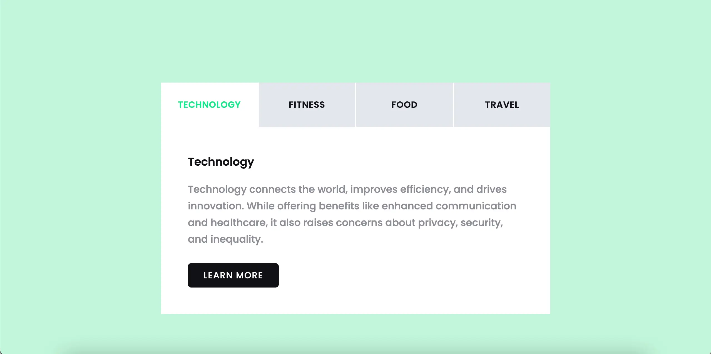

#Tabs using HTML, SCSS and JavaScript

This is a project that was completed by Instagram user: [snakecode0](https://www.instagram.com/reel/DGA6LyDilWo/?igsh=MXVmcnlvbm8wNnloMg==) that I have used as part of my ongoing learning and development.

Please see the live site [here](https://andrewh1188.github.io/Tabs-HTML-JS-SCSS/)

